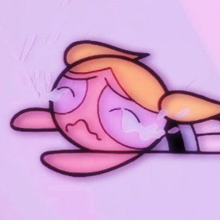
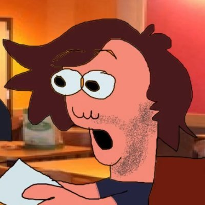
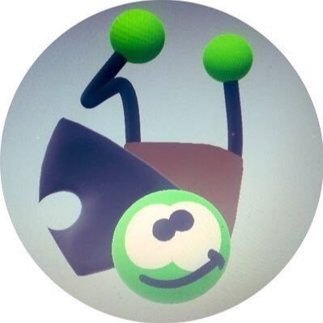

	

### Friday Night Funkin': Trashman's source code.

Support the original Newgrounds Build [here](https://www.newgrounds.com/portal/view/770371)!

Play the original build on the [Itch.io page](https://ninja-muffin24.itch.io/funkin)!

Play the Ludum Dare prototype of the original game [here](https://ninja-muffin24.itch.io/friday-night-funkin)!

Go support the original repository for the game [here](https://github.com/ninjamuffin99/Funkin)!

## Credits / Shoutouts
<!--me lol-->
<table style="span:90%">
	<tr>
		<th style="text-align:left"><h3>🖥 Programmers:</h3></th>
		<th style="text-align:middle"><h3>🖼 Artists:</h3></th>
		<th style="text-align:right"><h3>🎶 Musicians:</h3></th>
	</tr>
	<tr>
	<td>
		<a href='https://twitter.com/ninja_muffin99'><b>NinjaMuffin99</b></a> 
		
	</td>
	<td>
		<a href='https://twitter.com/phantomarcade3k'><b>PhantomArcade3K</b></a> and <a href='https://twitter.com/evilsk8r'><b>Evilsk8r</b></a> 
		
		 
	</td>
	<td>
		<a href='https://twitter.com/kawaisprite'><b>Kawaisprite</b></a> 
		
	</tr>
</table>

<h2>Mic'ed up engine Creators:</h2>

<table style="span:90%">
	<tr>
		<th style=”text-align:left”><h4>⚙️ Engine Creator:</h4></th>
		<th style="text-align:middle"><h4>🖥 Additional Programmers:</h4></th>
		<th style="text-align:right"><h4>🖼 Additional Artists:</h4></th>
	</tr>
	<tr>
	<td>
		<a href='https://twitter.com/Vershift'><b>Verwex</b> 
		</a>
	</td>
	<td>
		<a href='https://twitter.com/kadedeveloper'><b>KadeDev</b></a>, <a href='https://steamcommunity.com/profiles/76561198353865795'><b>Ash237</b></a>, <a href='https://www.youtube.com/channel/UCqBMDBboJaBHLoxO0H3EBgw'><b>Haya</b></a>, <a href='https://twitter.com/TentaRJ'><b>TentaRJ</b></a> and <a href='https://twitter.com/helpme_thebigt'><b>Rozebud</b></a> 
		</a>
		</a>
		</a>
		</a>
		</a>
	</td>
	<td>
		<a href='https://twitter.com/Sector0003'><b>Sector03</b></a> 
		</a>
	</tr>
</table>
<h2>Mod Creators:</h2>

<table style="span:90%">
	<tr>
		<th style=”text-align:left”><h4>⚙️ Mod Creator:</h4></th>
				<th style="text-align:middle"><h4>🖥 Mod Programmer:</h4></th>
		<th style="text-align:right"><h4>🖼 Mod Artist:</h4></th>
	</tr>
	<tr>
	<td>
		<a href='https://github.com/Purble11/Trashman'><b>Heighx</b> 
		</a>
	</td>
	<td>
		<a href='https://github.com/Purble11/Trashman'><b>Purble</b></a> 
		</a>
	</td>
	<td>
		<a href='https://github.com/Purble11/Trashman'><b>Frimple Schnips</b></a> 
		</a>
	</tr>
</table>
</table>

**This mod was made with love to Friday Night Funkin' and its community. Extra love to the team behind it. 💖**
</tr>
</tr>
</tr>
<h2>How to install</h2>

To install please click 
<a href='https://github.com/Verwex/Funkin-Mic-d-Up-SC#installing-the-required-programs'><b>here</b></a>
</tr>
</tr>
